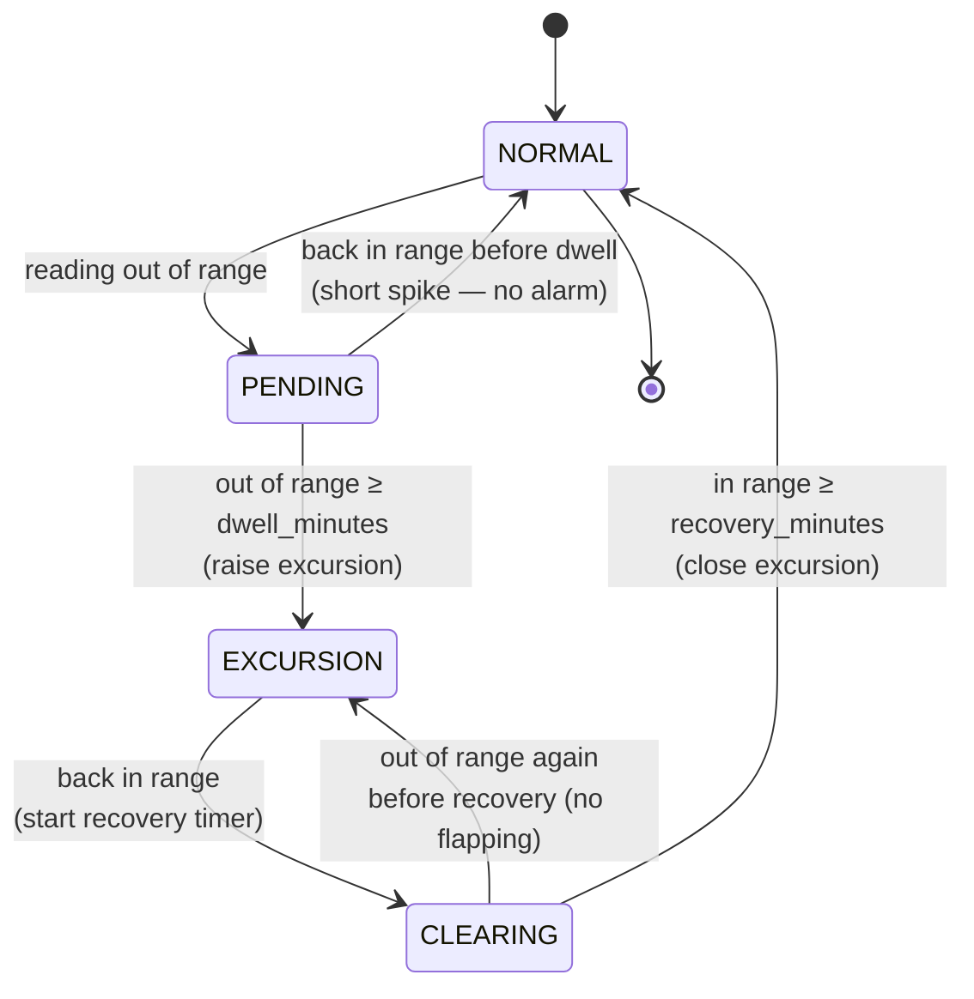

# Testing hardware code with no hardware

Why this file exists: this agent runs on a Raspberry Pi wired to a temperature sensor, but almost
none of its tests need a Pi, a sensor, a network, or Docker. This explains how, using what is built
through milestone 9 (the register-level sensor, the behaviour logic, GPIO, serial, the full fault
catalogue, and the soak test). The network tiers (software- and hardware-in-the-loop) are added in
the milestones noted at the end.

## The one idea

Every place the code touches the outside world is a `typing.Protocol` — a promise about the *shape*
of an object, not its identity (see `src/aurora_sensor_agent/protocols.py` and ADR 0001). Anything
with matching methods satisfies it. So the same code runs against real hardware, a simulator, or a
recorded trace, and a test just picks which one to hand in.

Analogy: a Protocol is a wall socket. The driver is an appliance with a plug. Real hardware, the
simulator, and the replay trace are three different things you can plug into the same socket — the
appliance neither knows nor cares which.

The six seams: `I2CBus`, `SerialPort`, `GpioPin`, `Clock`, `Transport`, `BufferStore`. Milestone 8
implements and exercises `I2CBus` and `Clock`; the other four are defined here as the agreed
contracts and implemented in milestones 9-11.

## The sensor, at the register level

`Sht4xDriver` (`drivers/sht4x.py`) speaks the actual SHT4x wire protocol rather than a convenient
abstraction, because the wire is where the interesting failures live:

1. Write a one-byte command (`0xFD` = measure, high precision).
2. Wait the conversion time (~8.3 ms). Read too early and a real chip NACKs.
3. Read six bytes: two 16-bit words, each followed by its own **CRC-8** (`protocol/crc.py`).
4. Verify both checksums, then convert:
   - `T[°C]  = -45 + 175 * raw_t  / 65535`
   - `RH[%]  =  -6 + 125 * raw_rh / 65535`, clamped to `0..100`.

Testing this directly (`tests/unit/protocol/test_sht4x_driver.py`) proves the command bytes, the
timing wait, word parsing, endianness, CRC acceptance *and rejection*, the conversion at the rails,
and out-of-range raw handling — all with a scripted fake bus that hands back bytes we choose.

### What a CRC protects against

The CRC-8 is a checksum byte the chip appends to each word. Flip a bit anywhere on the I²C wire and
the recomputed CRC no longer matches, so the driver *rejects* the reading instead of silently
trusting a corrupted temperature. `test_measure_rejects_corrupted_crc` flips a bit and asserts the
driver raises. This is the difference between a loud, catchable error and a bad number reaching the
cold-chain alerting engine.

## Simulator vs replay

| | Simulator (`sim/`) | Replay (`replay/`) |
|---|---|---|
| Where readings come from | A seeded fridge `ThermalModel` (setpoint, door-open warm-ups, noise, drift) | Fixed bytes recorded earlier |
| Good for | Exploring behaviour, injecting faults, generating data | Reproducing one exact scenario forever |
| Determinism | Same seed + same time → same reading | Byte-for-byte, on any machine |

The simulator is a **register-level chip model**: it accepts the same command bytes, enforces the
same conversion delay, and returns properly framed 6-byte responses with real CRCs. The unmodified
driver runs against it. Because it is pure in time (`sample(t)` depends only on `t` and the seed), a
run can be captured into a trace and replayed exactly — that is what `scripts/record_trace.py` does,
writing `tests/fixtures/traces/sim_baseline.jsonl`.

Run the simulator yourself:

```bash
# WSL (Ubuntu-24.04)
make sim                 # 10 readings from the simulated sensor
uv run aurora-agent sim --count 5 --interval 0 --seed 3
```

## Fault injection (chip/bus level)

The simulated bus can inject the failures a real sensor throws at you, at a chosen measurement index
(`sim/faults.py`, tested in `tests/unit/sim/test_faults.py`):

| Fault | What the driver must do |
|---|---|
| `BAD_CRC` | Reject the reading (`CrcError`), then succeed on the next one |
| `NACK` | Raise `OSError` on the command write, then recover |
| `TIMEOUT` | Raise `TimeoutError`, then recover |
| `SHORT_READ` | Reject a frame with too few bytes |
| `POWER_LOSS` | Raise, and leave the bus dead until reopened |
| `STUCK` | Notice the value never changes (frozen frame) |

Most faults are one-shot (a transient glitch) so a retry succeeds — that is what the backoff layer in
milestone 9 relies on. The higher-layer faults (NaN in the pipeline, disk full, clock jump) live at
the buffer/clock seams and are injected there in milestone 9.

## The driver contract suite

`tests/driver_contract/` holds one behavioural suite (`Sht4xStackContract`) and runs it against each
bus. `sim` and `replay` run everywhere; `real` is skipped unless a Pi with an SHT4x is wired up, but
the class still documents exactly what the real bus must satisfy. A separate test proves the real bus
imports and constructs with no `smbus2` installed — its hardware imports are lazy, deferred to the
first actual read.

## The behaviour layer (milestone 9)

Above the driver sits the logic that turns readings into decisions. All of it is pure or takes an
injected `Clock`, so it is tested with no hardware, network, or Docker.

### The excursion state machine

The centrepiece (`logic/excursion.py`, ADR 0003). The rule in one line: out of the safe band for
longer than `dwell_minutes` raises an excursion; it clears only after `recovery_minutes` back in
range. A door opening (a short spike) must not alarm.



`PENDING → NORMAL` is the door-open case (a short spike never alarms); `CLEARING → EXCURSION` stops an
open excursion flapping closed on a single reading dipping back into range.

It is a pure function of `(timestamps, values, policy)` — it never reads a clock. That is what lets a
seven-day test run in milliseconds and what lets the server re-derive the *same* excursions later. The
shared fixtures in `tests/fixtures/excursions/cases.json` are the contract both sides are held to.

Analogy: it is a kettle's thermostat with a delay. It does not cut out the instant the water dips
below temperature (that would be someone briefly lifting the lid); it waits to be sure.

### Conditioning: calibration + median filter

Before a reading reaches the machine, the agent applies a fixed calibration offset and a
**median-of-N** filter (`logic/filter.py`). A median, not an average, because one wild sample (a
glitch that passed CRC by chance) must not move the result — the median ignores a lone outlier. A
NaN/inf reading is rejected outright, because `nan > max` is `False`, so a NaN would otherwise look
in-range forever.

### Store-and-forward buffer

`buffer/sqlite.py` (ADR 0004) writes every reading to local SQLite *before* sending, so an outage,
reboot, or power cut loses nothing. It is bounded — a ring buffer that drops the oldest un-sent
reading when full — so an offline device cannot fill its disk. The row id is the reading's
`sequence`; `AUTOINCREMENT` guarantees it is never reused.

### Batching, backoff, idempotency

Buffered readings drain in batches (`logic/batch.py`) bounded by count and bytes. Each batch has a
device-generated idempotency key derived from its rows, so a retried batch is dropped by the server
instead of duplicated. A failed publish backs off exponentially with **full jitter**
(`logic/backoff.py`) so a reconnecting fleet does not stampede the broker.

### GPIO and serial

- **GPIO** (`real/gpio.py`, driven by `logic/indicator.py`): the status LED and buzzer. Tested through
  `gpiozero`'s `MockFactory`, which emulates pins in memory — the real `gpiozero` code path runs on a
  laptop.
- **Serial** (`drivers/legacy_probe.py`): the legacy UART probe with an ASCII, checksum-framed
  protocol. The frame parser is pure (split frames, garbage, bad checksum), and the I/O is tested over
  `pyserial`'s `loop://` and a real `pty` pair — no hardware.

### The higher-layer fault catalogue

The chip/bus faults above are joined by the faults that strike after decoding (`sim/pipeline_faults.py`,
tested in `tests/faults/`): a **NaN** in the pipeline (rejected), a **disk full** on a buffer write
(flagged, no crash, no loss of buffered data), and a **clock jump** (no spurious excursion, skew
flagged). The guarantee: no fault loses buffered data or produces a duplicate on the server.

### Soak with a fake clock

`tests/soak/` runs seven simulated days in a fraction of a second on a `FakeClock` and checks memory
does not creep (`tracemalloc`), the buffer stays bounded across a two-day outage, and behaviour is
correct across a DST change. Run it with `make soak`.

Watch the whole loop run: `make run` (or `uv run aurora-agent run --count 10`).

## The network tiers (milestone 11)

Everything above proves the agent with no network. These two tiers add the wire — one against real
containers, one against real silicon.

### Software-in-the-loop (`tests/sil/`)

This is the only tier that leaves the laptop. It uses **testcontainers** to bring up the real stack —
Postgres, Redis, a Mosquitto broker, the built `appointments-api` image serving HTTP, and a second
container running that image's MQTT ingestion worker — then drives the agent's *real* transports end to
end and reads the telemetry back through the API. The two paths:

- **HTTP:** the real `HttpTransport` posts a batch to `POST /devices/{id}/telemetry:batch` with the
  per-device `X-Device-Secret`, and the API's time-series endpoint then shows the points.
- **MQTT:** the whole `SensorAgent` (simulated sensor, real `MqttTransport`) publishes to the broker,
  the worker ingests it, and the same time-series shows the points.

This is what the fakes can never prove: that the wire format, the topic scheme, and the auth line up
across two independently built repos. It needs Docker and the `appointments-api:local` image; without
either it **skips cleanly**, so the rest of the suite stays green on a bare laptop. Run it with
`make sil`. Design and the data-path diagram are in ADR 0005.

### Hardware-in-the-loop (`tests/hil/`)

The driver against a **real** SHT4x over a real I²C bus — the one thing sim/replay cannot prove: that
the real wiring, timing, and CRC handling work against silicon. These are marked `@pytest.mark.hil`,
**deselected by default** everywhere, and a second guard skips them unless `/dev/i2c-1` exists or
`AURORA_HIL=1` is set, so even a bare `pytest` stays green with no hardware. On a wired Pi:
`AURORA_HIL=1 pytest tests/hil -m hil`. The nightly `hil` CI job runs them on a self-hosted runner,
gated behind the `HIL_ENABLED` variable. Wiring is documented in `tests/hil/README.md`.

## What runs where

| Tier | Needs hardware? | Needs Docker/network? | Milestone |
|---|---|---|---|
| Register-level unit (`tests/unit/protocol/`) | No | No | 8 |
| Simulator + fault injection (`tests/unit/sim/`) | No | No | 8 |
| Driver contract (`tests/driver_contract/`) | No (real tier skipped) | No | 8 |
| Logic unit — excursion state machine, filters (`tests/unit/logic/`) | No | No | 9 |
| GPIO (`tests/unit/gpio/`) | No (`gpiozero` MockFactory) | No | 9 |
| Serial (`tests/unit/serial/`) | No (`loop://` + `pty`) | No | 9 |
| Full fault catalogue (`tests/faults/`) | No | No | 9 |
| Soak (`tests/soak/`) | No (fake clock) | No | 9 |
| Software-in-the-loop (`tests/sil/`) | No | Yes (testcontainers) | 11 |
| Hardware-in-the-loop (`tests/hil/`) | Yes | — | 11 (deselected by default) |
