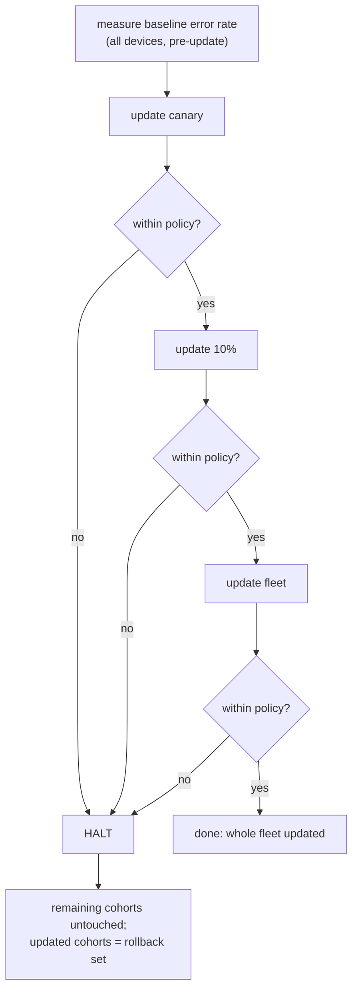

# OTA updates and staged rollout

Why this file exists: updating devices over the air is the riskiest thing the fleet does. This is the
runbook — how an update is signed, how a device proves it is genuine before applying it, how a rollout
is staged so a bad build cannot take down the whole cold chain, and how to roll back. The design
reasoning is in ADR 0006.

## The signed manifest

A release ships the artifact (a wheel or `.deb`) plus a small JSON manifest:

```json
{
  "payload": {
    "version": "1.1.0",
    "artifact": "aurora_sensor_agent-1.1.0-py3-none-any.whl",
    "sha256": "<hex digest of the artifact>",
    "size": 12345,
    "released_at": "2026-09-28T00:00:00+00:00",
    "min_agent_version": "1.0.0"
  },
  "signature": "<base64 Ed25519 signature over the canonical payload>",
  "algorithm": "ed25519"
}
```

The signature covers the *canonical* form of `payload` (sorted keys, no spaces). The signer and the
agent hash the same bytes via `aurora_sensor_agent.ota.canonical_payload_bytes`, so verification is
byte-exact.

## The three checks the agent makes (`ota.prepare_update`)

1. **Signature** — Ed25519 verify against the pinned public key. The agent never holds the private key.
2. **Integrity** — the artifact's SHA-256 and byte size match the signed payload.
3. **Direction** — the version is strictly newer than what is running.

If any check fails, the update is refused. All three are covered by `tests/unit/test_ota.py`.

## Sign a release

```bash
# WSL — one-time keypair (private key stays out of the repo; keys/ is gitignored)
uv run python scripts/gen_ota_key.py

# build the artifact, then sign it
make wheel
uv run python scripts/build_ota_manifest.py \
  --artifact dist/aurora_sensor_agent-1.1.0-py3-none-any.whl \
  --version 1.1.0 --private-key keys/ota_private.pem --out dist/manifest.json

# verify exactly as a device would (signature + integrity + direction)
uv run python scripts/build_ota_manifest.py --verify \
  --artifact dist/aurora_sensor_agent-1.1.0-py3-none-any.whl \
  --manifest dist/manifest.json --public-key keys/ota_public.pem --current-version 1.0.0
```

`make ota-demo` runs that whole sign → verify loop end to end with a throwaway key. In CI the release
private key is the `OTA_PRIVATE_KEY` secret; `scripts/ci_sign_ota.sh` uses it when present and an
ephemeral key otherwise, so the flow is always exercised.

## Staged rollout

`fleet.yaml` lists the devices and the rollout cohorts — smallest blast radius first:

```yaml
cohorts:
  - { name: canary,      devices: [dev-oslo-01] }
  - { name: ten_percent, devices: [dev-oslo-02] }
  - name: fleet
    devices: [dev-oslo-03, ..., dev-bergen-05]
rollout:
  error_rate_threshold: 0.2   # allowed rise over the pre-update baseline
  max_error_rate: 0.5         # hard cap regardless of baseline
```

`StagedRollout` applies the verified version to each cohort in turn, measures the fleet simulator's
error rate after each, and halts if it rises past the policy.



Run it:

```bash
# WSL
make rollout               # healthy update -> completes all cohorts
make rollout BAD_BUILD=1   # simulate a bad build -> halts at the canary cohort
```

`BAD_BUILD=1` makes every device's uplink die after the update, so the canary's error rate spikes and
the rollout stops before 10% or the fleet ever get the build — the canary doing its job.

## Rollback path

When a rollout halts:

1. **Stop is automatic.** The remaining cohorts never received the build.
2. **Identify the blast radius.** `RolloutResult.updated_device_ids` lists every device that got the
   new version — that is the rollback set (in the demo, `make rollout BAD_BUILD=1` prints
   `Roll back: [...]`).
3. **Re-pin the last good version.** Point those devices back at the previous *signed* manifest and
   push it. The version-direction check would normally refuse a downgrade, so a rollback is performed
   as a deliberate re-pin of the known-good release (bump/override the running version marker), not by
   tricking the agent into installing an older build.
4. **Confirm.** Watch the health beacons / time-series until the rolled-back devices report a normal
   error rate again, then investigate the bad build before retrying the rollout.
