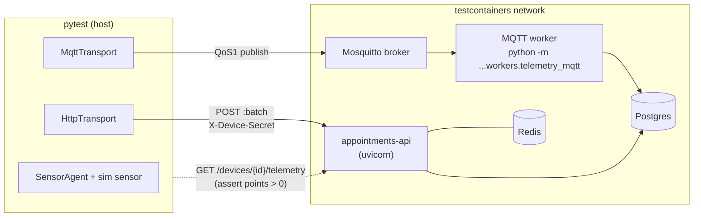

# 5. Real MQTT/HTTP transports and a software-in-the-loop tier

- Status: accepted
- Date: 2026-09-28

## Context

Through milestone 9 the agent published to an in-memory fake transport, so the whole run loop was
testable with no network. Milestone 11 needs the real thing: the agent has to reach the backend the
same way a device in a clinic does, and we need a test that proves it — not against a mock of the API,
but against the *actual* API image, the *actual* broker, and the *actual* MQTT ingestion worker.

Two delivery paths exist by design (spec §7): MQTT is the normal path (cheap, keeps a session open,
lets the broker fan out); HTTPS is the fallback when the broker is unreachable but the API is not.
Both must funnel into the same server-side ingestion, and both must be safe to retry.

## Decision

**One `Transport` seam, three real implementations.** All satisfy the same protocol (`publish`,
`close`) as the in-memory fake, so nothing above the seam changes.

| Transport | Library | How it delivers | On failure |
|---|---|---|---|
| `MqttTransport` | paho-mqtt v2 | publish to the device topic at **QoS 1**, wait for the broker PUBACK | raises `MqttError` (a `ConnectionError`) |
| `HttpTransport` | httpx | POST the batch envelope to `POST /api/v1/devices/{id}/telemetry:batch` with `X-Device-Secret` | 5xx/429/network raise for retry; a non-429 4xx is raised **and logged** (a credential/contract problem retrying won't fix) |
| `FallbackTransport` | — | try MQTT first; on a `ConnectionError` retry the *same* batch over HTTP | re-raises if both fail, so the agent buffers and retries next cycle |

**Wait for the acknowledgement.** `MqttTransport.publish` blocks on the PUBACK, so a delivery failure
surfaces *synchronously* inside the agent's drain loop — that is what lets the loop catch it, leave
the readings in the store-and-forward buffer, and back off (see `agent.SensorAgent._drain`). A
fire-and-forget publish would silently lose readings on a flaky link.

**QoS 1 + the device idempotency key = effectively-once.** QoS 1 is "at least once": the broker may
redeliver after a reconnect. The batch already carries a device-generated idempotency key and
`(device_id, sequence)` per reading (ADR 0004), and the server drops duplicates, so a redelivered
batch becomes one row set in the database. We get at-least-once on the wire and exactly-once in the
store.

**Inject the client for tests.** The paho client is built by a factory that the unit tests replace
with a fake, and `HttpTransport` takes an injectable httpx client, so every transport failure mode is
proven with no broker and no server (`tests/unit/transport/`).

**Auth differs by path, on purpose.** HTTP carries a per-request header (`X-Device-Secret`), so the
device proves its identity directly. MQTT has no per-message header, so the API worker takes the
device id from the *topic* and trusts the broker's ACL to bind a device to its own topic. This matches
the milestone-10 worker exactly (`aurora/v1/clinic/{clinic_id}/device/{device_id}/telemetry`).

**A software-in-the-loop (SIL) tier proves the seams line up.** `tests/sil/` (marked `sil`) uses
testcontainers to stand up the real stack, then drives the agent's real transports end to end and
reads the telemetry back through the API:

The two SIL tests: the real `HttpTransport` posts a batch and the time-series shows the points; the
whole `SensorAgent` (sim sensor, real `MqttTransport`) publishes to the broker and the worker ingests
it.

## Consequences

- The agent's field delivery path is exercised against the real API, broker, and worker — the one
  thing the in-memory fake can never prove: that the wire format, topic scheme, and auth actually line
  up across two independently built repos.
- The SIL tier needs Docker and the built `appointments-api:local` image. Without either it **skips
  cleanly** (the fixture checks and calls `pytest.skip`), so `make ci-local` on a bare laptop and a
  fork's CI stay green. It runs in its own CI job and via `make sil`.
- The unit tiers stay hardware/network/Docker-free: the transport failure modes are proven with a
  fake paho client and httpx's `MockTransport`, so a broken broker or server is not needed to test
  "what does the agent do when the broker is down".
- New runtime dependencies: `paho-mqtt`, `httpx`. New dev dependency: `testcontainers`.
