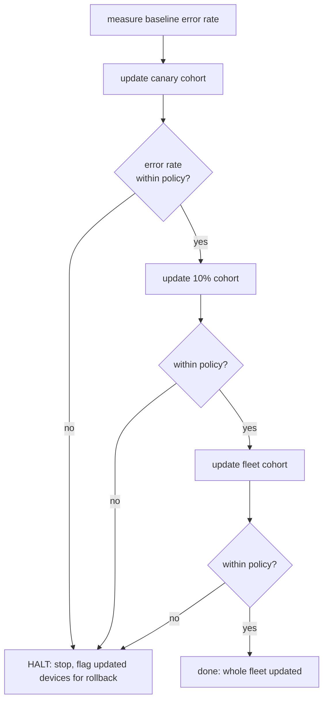

# 6. Signed OTA updates and a staged, self-halting rollout

- Status: accepted
- Date: 2026-09-28

## Context

A fleet of devices in clinics has to be updatable over the air — you cannot drive to every fridge.
But an update mechanism is also the fleet's biggest risk. Two failure modes matter:

1. **A malicious or corrupted update.** A device that installs whatever bytes arrive is a fleet-wide
   remote-code-execution waiting to happen.
2. **A bad build we signed ourselves.** Even a genuine update can be broken. Shipping it to every
   device at once takes down the whole cold chain before anyone notices.

## Decision

### Verify before you apply (signed manifest)

Every release ships a small **signed manifest** next to the artifact. The agent holds only the
matching **public** key (pinned into the image) and refuses to apply anything that fails three checks,
in order (`src/aurora_sensor_agent/ota.py`):

| # | Check | Stops |
|---|---|---|
| 1 | **Signature** — Ed25519 over the canonical JSON `payload` | a forged/tampered update (can't sign without the private key) |
| 2 | **Integrity** — artifact SHA-256 + byte size match the signed payload | a truncated or swapped download |
| 3 | **Direction** — the manifest version is newer than what runs | replaying a signed *old* build onto a known-vulnerable version |

The signer and the verifier hash the *same* bytes: `canonical_payload_bytes` serialises the payload
with sorted keys and no spaces, and the build script signs exactly that. Only verification lives in the
agent — that is the security-critical part and the one worth testing hard (`tests/unit/test_ota.py`
covers every failure mode with an ephemeral keypair). The actual swap (replace the package, restart
the service) is a packaging concern, handled by the `.deb` (ADR 0007); `prepare_update` hands it a
manifest it has already proven trustworthy.

The private key never lives in the repo. `scripts/gen_ota_key.py` makes a keypair for demos (into a
gitignored `keys/`); in CI the release key is a secret.

### Roll out in stages, and halt on your own metric

`StagedRollout` (`src/aurora_sensor_agent/fleet/rollout.py`) pushes a verified version through the
cohorts in `fleet.yaml` — **canary → 10% → fleet** — smallest blast radius first. After each cohort it
measures the fleet simulator's error rate (failed sensor reads + failed publishes per cycle) and stops
the moment a cohort regresses:

- halt if the cohort's error rate rises more than `error_rate_threshold` above the pre-update
  baseline, **or** exceeds the absolute `max_error_rate` cap.

`run_verified` ties the two together: verify the OTA manifest first, then roll out `payload.version`.

## Consequences

- A device applies only genuine, intact, forward updates — the three checks are independent, so
  defeating one does not help.
- A bad build is caught at the canary (one device), never the whole fleet. The demo shows it:
  `make rollout BAD_BUILD=1` halts at the canary cohort.
- **Rollback path:** on halt, the remaining cohorts never receive the build, and the already-updated
  cohorts (`RolloutResult.updated_device_ids`) are the rollback set — re-pin and re-push the previous
  signed version to exactly those devices. The runbook is in `docs/OTA_ROLLOUT.md`.
- The error-rate signal here comes from the simulator; in production it comes from the real fleet's
  health beacons, but the decision shape is identical.
- New runtime dependencies: `cryptography` (Ed25519), `PyYAML` (fleet.yaml).
